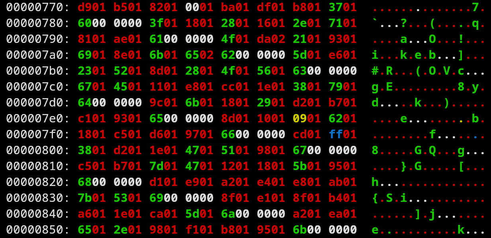

# PayloadEntropy
An analysis of ways to reduce entropy in a payload.

Currently, the examples that exist for reducing entropy of payloads in memory or in a binary are prone to breaking or just plain useless. MalDev, for example, has this linked list implementation that can obfuscate things slightly but has virtually zero measurable impact on entropy reduction, contrary to what they seem to think.

The only way to reduce entropy is to introduce patternization of the data. This means the size will increase proportionally with the reduction in entropy. Here, the intent is to achieve a nice middle ground between size and entropy.

# Code
- Calc-entropy: Calculate entropy of files
- RLE-Huffman.c: Encode/decode files

# Investigation
Implementation and Entropy calculation:
- **MalDev**:      7.47
- **Huffman**:     7.17
- **RLE+Huffman**: 4.97

RLE creates repeating patterns, and Huffman encodes those. We are effectively blowing up the data and then shrinking it down.

What the data looks like after transformation in `xxd`:

# Entropy Analysis
Several tests of equal length (entropy calculation is length dependent):

- 7.81 for 961 bytes of `/dev/urandom` into a file
- 1.74 for 961 bytes of repeating text
- 4.73 for the entropy calc's binary
- 4.01 for `./bin/jit`
- 5.48 for `./minilua`
- 5.06 for `./README.md`
- 3.54 for `./clean.sh`
- 7.78 for `./a.pdf`
- 6.75 for `./h.bc`
- 4.54 for `./h.cpp`
- 3.97 for `./hello.s`

High entropy can probably be defined as above 5.5:

- 1.0 - 2.9 are files that have large blocks of repeating patterns, mostly nulls for example.
- 3.0 - 5.5 are text files but also many executables.
- 5.6 - 6.8 seems to be executable code blocks and data.
- Above 6.8 is basically very high entropy.
- 7.4 and above is straight-up random/encrypted data.

